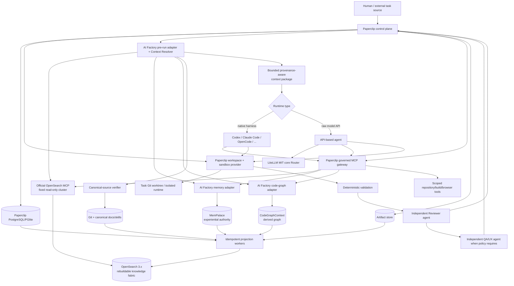
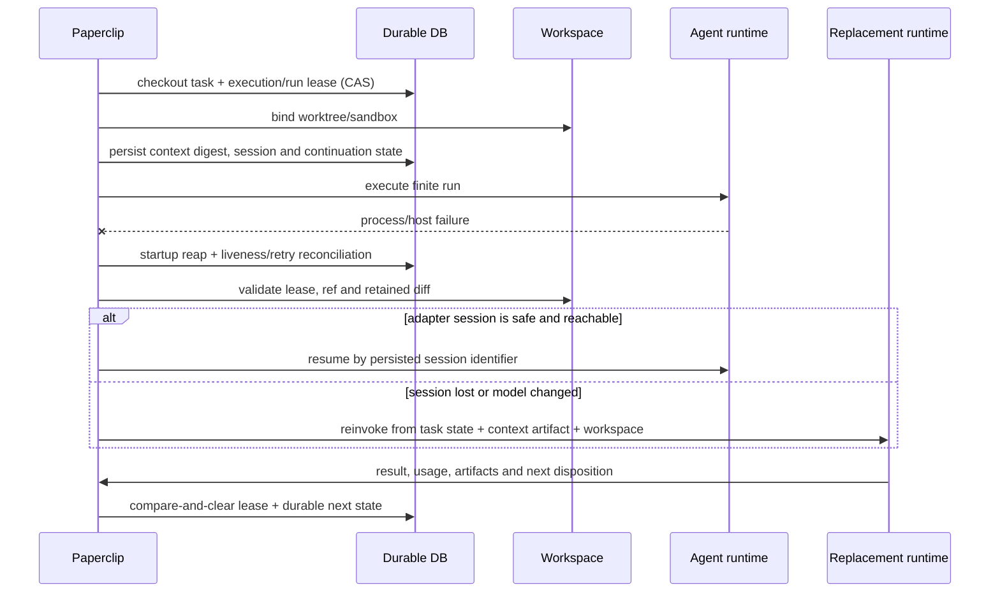

# AI Factory — V1 Adoption Architecture

**Status:** Target architecture selected; integration kickoff blocked by Milestone 0

**Decision date:** 2026-09-15

**Scope:** Phase 0.5 open-source adoption spike; this is not a V1 implementation

> **Admission hold (2026-09-15):** Paperclip `5282cab` failed mandatory
> environment-lease cleanup and transparent pre-run delegation gates. This
> document remains the target architecture, not an authorization to start V1.
> LiteLLM is narrowed to its MIT core Router; its current server `proxy` extra
> directly installs proprietary code. See the
> [Milestone 0 report](../implementation/MILESTONE_0_DEPENDENCY_ADMISSION.md).

## 1. Decision

AI Factory will build its engineering intelligence and integration seams on top
of mature commodity components. It will not build a second task engine, workflow
engine, MCP supervisor, sandbox lifecycle, skill specification, code graph,
provider gateway, or memory framework in V1.

Once admitted, Paperclip is the authoritative operational control plane. Agent Skills is the
canonical portable skill format. OpenSearch 3.x remains the rebuildable
knowledge fabric and its official Python MCP server is the retrieval provider.
Paperclip's governed MCP gateway and execution-workspace/sandbox-provider
contract own the corresponding runtime concerns. CodeGraphContext supplies the
single V1 structural graph. LiteLLM's MIT core Router is used only for raw API
model calls.
MemPalace is the single experiential-memory authority and projects a searchable
view into OpenSearch.

This is a conditional adoption, not a blank cheque. Paperclip, MemPalace, and
CodeGraphContext are young or fast-moving and have explicit acceptance gates in
section 12. No selected dependency may require a long-lived fork.

## 2. Selected V1 stack

| Concern | V1 selection | Decision and boundary |
| --- | --- | --- |
| Control plane | Paperclip, pinned from `5282cab` | **ADAPT; NOT ADMITTED.** Intended to own logical agents, tasks, runs, leases, continuation, review policies, budgets, approvals, workspaces, active runtime configuration, and run history after its blocking gates pass. |
| Durable workflow | Paperclip wake queue, heartbeat scheduler, execution locks, and recovery services | No DBOS beside Paperclip. DBOS is the mutually exclusive fallback if Paperclip fails its adoption gates. |
| Skills | Agent Skills specification; canonical packages in Git | **ADOPT.** Paperclip skill records/installations are runtime projections. Namespaced metadata and `ai-factory.yaml` sidecars carry AI Factory policy. |
| Knowledge fabric | Dedicated OpenSearch 3.8.x cluster | Rebuildable projection only. Use filtered lexical/vector hybrid retrieval, multi-search, aliases, and Search Relevance Workbench. |
| Knowledge MCP | `opensearch-mcp-server-py` 0.11.0 at `fcb23ec` | **ADAPT.** Fixed-cluster, read-only, allowlisted deployment behind bounded AI Factory capability aliases. |
| MCP runtime/security | Paperclip managed MCP gateway | Owns the active catalog, profiles, grants, approvals, short-lived run tokens, rate limits, redaction, runtime slots, and MCP audit. ToolHive is deferred to avoid duplicate policy/catalog/audit truth. |
| Execution sandbox | Paperclip execution workspaces and `sandbox_provider` contract | Trusted-host V1 uses task-scoped Git worktrees. Untrusted execution must use one tested Paperclip sandbox provider before admission. SWE-ReX is a deferred provider option, not a second lifecycle owner. |
| Code graph | CodeGraphContext 0.6.13 at `2ef71b0` | **ADAPT.** One bounded read-only graph service, containerized on Linux until its Windows embedded backend passes. Git remains code truth. |
| API model gateway | LiteLLM MIT core Router 1.102.0 at `b94b8bc` | **ADAPT.** Embed the core Router for provider normalization, API-call fallback, routing primitives, and usage estimates. The server `proxy` extra is not admitted under the open-source decision. |
| Agent runtime adapters | Paperclip native/ACP adapters, after control-plane admission | Codex, Claude Code, OpenCode, Cursor, Gemini, and similar harnesses retain their native tools and session behavior and do not pass through LiteLLM. |
| Memory | MemPalace 3.9.0 at `38260df` | **ADAPT.** Sole durable experiential-memory authority, restricted to memories/diaries/temporal facts. No MemPalace task coordination, logstream, or artifact authority. |
| Artifact storage | Paperclip storage provider | Paperclip stores authoritative artifact metadata; the configured durable object/filesystem store owns bytes. Use `local_disk` only for the single-host V1 slice and an S3-compatible provider before multi-host operation. |
| Telemetry | Paperclip run/cost/activity records after admission, plus OpenSearch projection | Paperclip owns native operational evidence only after admission. OpenSearch supports cross-run analysis. Detailed logs/traces become artifact objects. |
| Evals | Deterministic repository checks plus OpenSearch Search Relevance Workbench | AI Factory owns eval definitions and acceptance metrics in Git. Promptfoo is deferred until model/prompt regression suites justify it; Phoenix and Langfuse are deferred. |

## 3. Physical/runtime architecture

The governed gateway is on every Paperclip-launched tool path. It does not secure
unmanaged clients that connect directly to an MCP server; network and credential
policy must make bypass unavailable.

## 4. Authoritative sources of truth

Each row has exactly one authority. A projection, cache, installation, or policy
template is not a second authority.

| Data class | Authoritative owner | Derived/projection copies |
| --- | --- | --- |
| Task state | Paperclip database | OpenSearch task projection |
| Run/checkpoint/retry state | Paperclip database | OpenSearch event/run projection; artifact logs |
| Logical agent registry and active model/runtime binding | Paperclip database | Git examples/templates; OpenSearch discoverability |
| Canonical architecture and project rules | Git-tracked Markdown/YAML | OpenSearch docs index |
| Skill content and versions | Git `.agents/skills/` packages | Paperclip skill/install rows; OpenSearch metadata |
| Experiential/episodic memory | MemPalace | OpenSearch memory search projection |
| Artifact bytes | Configured Paperclip storage provider | OpenSearch artifact metadata |
| Artifact identity/metadata | Paperclip database | OpenSearch artifact metadata |
| Detailed native run/cost/activity telemetry | Paperclip database | OpenSearch telemetry/events; exported artifacts |
| Structural code relationships | CodeGraphContext graph for a recorded Git revision | OpenSearch symbol metadata; graph is rebuilt from Git |
| Current source code | Git | Worktrees, CodeGraphContext, OpenSearch pointers |
| Active MCP catalog, permission bindings, approvals, and audit | Paperclip database/gateway | Git role/capability policy definitions; OpenSearch audit projection |
| Logical capability semantics and role policy definitions | Git under `autonomy/` | Paperclip resolved profiles/bindings; OpenSearch capability metadata |
| Active model/provider configuration | Paperclip agent/runtime configuration | Git routing policy definitions; OpenSearch telemetry |
| Model-selection and escalation policy definition | Git under `autonomy/models/` | Paperclip selected binding per run |
| Eval definitions and promotion thresholds | Git under `autonomy/evals/` | OpenSearch eval results |
| Cross-organizational retrieval | Original sources above remain authoritative | OpenSearch is the disposable retrieval fabric |

## 5. Dependency authority and exit boundaries

### Paperclip

- **Owns:** operational task/run truth, checkout and execution leases, logical
  agents and active runtime bindings, wakeups/heartbeats, retries, budgets/cost
  ledger, execution policies, approvals, workspace leases, runtime MCP policy,
  activity history, and artifact references.
- **Does not own:** canonical architecture/project truth, canonical skill source,
  experiential memory, current Git contents, OpenSearch truth, or code structure.
- **Projects:** task/run/cost/review/QA/approval/audit metadata to OpenSearch.
- **Failure:** no new work is admitted; running model processes may die; durable
  rows and workspace contents remain. Known recovery defects can strand or
  duplicate a run, so lease and restart fault injection is an adoption gate.
- **Recovery:** restart, reap orphaned runs, reconcile stranded issues, validate
  checkout/execution ownership, and resume the adapter session when safe or
  reinvoke a different model from task state plus the durable context package.
- **Replacement:** export Paperclip operational records into the AI Factory
  control-plane contract, stop admission, drain/reconcile active leases, then
  cut over to a mutually exclusive replacement such as a DBOS-backed control
  plane. OpenSearch projections are rebuilt, not migrated as truth.

### Agent Skills

- **Owns:** the portable package syntax and discovery contract; Git owns actual
  AI Factory skill content.
- **Does not own:** authorization, role grants, task state, or runtime loading.
- **Projects:** skill name/version/description/risk/capability metadata to
  Paperclip and OpenSearch.
- **Failure:** an invalid/incompatible skill is withheld; the task blocks or uses
  an explicitly versioned fallback.
- **Recovery/replacement:** validate in CI and retain a small loader interface.
  The Markdown instructions remain readable if the external validator disappears.

### OpenSearch and the official MCP server

- **Owns:** no canonical business fact. OpenSearch owns only its rebuildable
  index state; the MCP server owns no durable state.
- **Does not own:** tasks, memory, Git truth, permissions, or full code graphs.
- **Projects:** all searchable envelopes from canonical systems.
- **Failure:** agents continue from task state and direct canonical sources with
  degraded retrieval; projection events accumulate/replay.
- **Recovery/replacement:** recreate indexes from durable sources and swap stable
  aliases. The Context Resolver's logical contract permits a different search
  backend or MCP provider later.

### Paperclip MCP gateway

- **Owns:** the active application/connection/catalog/profile model, evaluated
  grants and denials, approval evidence, short-lived run tokens, rate limits,
  redaction, runtime slots, and append-only MCP audit.
- **Does not own:** logical capability definitions in Git or provider data.
- **Projects:** catalog health, policy decisions, approvals, and tool-call audit
  metadata to OpenSearch.
- **Failure:** fail closed for governed tools; block the affected task and retry
  only idempotent reads or calls carrying an operation key.
- **Recovery/replacement:** restart supervised runtime slots and reissue tokens.
  A future ToolHive substrate may replace process/container hosting only after a
  single policy authority and audit stream are proven.

### Paperclip workspace/sandbox layer

- **Owns:** task-to-workspace binding, lease, lifecycle, branch/ref metadata,
  synchronization, and cleanup state.
- **Does not own:** Git truth after integration, task state, or artifacts that
  were not persisted through Paperclip.
- **Projects:** workspace/ref/status metadata to OpenSearch.
- **Failure:** quarantine the workspace, preserve logs/diff as artifacts, release
  no lease until ownership is reconciled, then rebuild from the recorded base.
- **Recovery/replacement:** create a fresh worktree/sandbox and rehydrate from Git
  plus artifacts. The `sandbox_provider` interface permits a later provider such
  as SWE-ReX without changing task authority.

### CodeGraphContext

- **Owns:** the derived structural graph for an explicitly recorded repository
  revision.
- **Does not own:** source code, human-facing canonical docs, task impact
  decisions, or arbitrary query authorization.
- **Projects:** bounded symbol/module/path/summary/graph-ref metadata to
  OpenSearch.
- **Failure:** fall back to text search and language-native tools; mark graph
  freshness unavailable rather than returning stale edges as current.
- **Recovery/replacement:** delete and rebuild from Git. The AI Factory adapter
  normalizes symbol/caller/dependency/affected-path operations so the engine can
  be swapped.

### LiteLLM core Router

- **Owns:** no AI Factory durable state; it executes normalized raw-model API
  calls and local retry/fallback/routing policy for that call class.
- **Does not own:** logical agent identity, native harness sessions, task retry,
  final budget truth, or model-selection policy definitions.
- **Projects:** provider/model/usage/latency/error estimates into Paperclip's run
  ledger, then OpenSearch.
- **Failure:** Paperclip records the attempt; bounded call fallback may run inside
  LiteLLM, while task-level retry remains Paperclip's decision.
- **Recovery/replacement:** swap the API adapter/library; native harness adapters
  are unaffected.

### Native and API agent runtime adapters

- **Owns:** no durable organizational truth; each adapter owns only the live
  finite runtime process/protocol interaction and provider-session handle.
- **Does not own:** logical agent identity, task status, workspace truth, model
  selection policy, approval, or task-level retry.
- **Projects:** result, session/continuation handle, usage, errors, and artifact
  references into the Paperclip run record.
- **Failure:** Paperclip marks/reconciles the interrupted attempt and retains the
  task, context package, workspace, and prior evidence.
- **Recovery/replacement:** resume the same provider session only when its adapter
  proves that safe; otherwise reinvoke the same logical agent through another
  adapter from durable state. Adapters are replaceable behind Paperclip's runner
  contract.

### Artifact storage

- **Owns:** the configured durable Paperclip storage provider owns artifact bytes;
  Paperclip owns artifact IDs, metadata, checksums, and task/run relationships.
- **Does not own:** task status, canonical docs/code, memory, or telemetry meaning.
- **Projects:** artifact identity, content type, checksum, source run, retention,
  and authorized retrieval pointer to OpenSearch; large content is not copied by
  default.
- **Failure:** a run that requires an artifact cannot be accepted until the byte
  write and metadata reference are durable; partial objects are quarantined.
- **Recovery/replacement:** retry idempotently by checksum, restore/replicate the
  object store, and reconcile Paperclip metadata. A provider migration copies and
  verifies objects before atomically changing pointers; logical artifact IDs stay
  stable.

### MemPalace

- **Owns:** durable experiential memories, specialist diaries, provenance fields,
  and temporal fact/supersession links.
- **Does not own:** tasks, canonical/current truth, permissions, logs, artifacts,
  or the shared knowledge index.
- **Projects:** selected memory content/summary, scope, status, provenance,
  temporal bounds, and source pointer to OpenSearch.
- **Failure:** task execution continues without memory; writes queue only in a
  bounded Paperclip task, never in an untracked local buffer.
- **Recovery/replacement:** restore the single-writer store from backup and
  replay the projection. Export through the AI Factory memory contract to
  OpenSearch Agentic Memory or another provider if needed.

## 6. How a task obtains bounded context

1. Paperclip claims the issue with an atomic checkout and creates/reattaches the
   task workspace.
2. The AI Factory pre-run adapter resolves role, project overlay, skill versions,
   logical capabilities, task type, risk, and context budget.
3. The Context Resolver performs separate bounded queries for canonical docs,
   active decisions, memories/incidents, similar tasks/reviews, capabilities,
   and code metadata through the read-only OpenSearch MCP connection.
4. It queries MemPalace and CodeGraphContext only when the selected skill/task
   needs their richer semantics.
5. Canonical claims and selected code pointers are verified against Git/original
   sources. Current Git/canonical material outranks memory and old projections.
6. The resolver deduplicates, ranks, labels provenance/freshness/supersession,
   and enforces per-domain hit, byte, and token ceilings.
7. A context-package artifact and digest are persisted; only the bounded content
   plus artifact pointer enters the agent run. The run's `contextSnapshot`
   records resolver version, query set, source revisions, budget, and digest.

The first implementation ceiling is configurable, but a run must always have a
hard total token/byte limit and lower per-domain limits. The official MCP
server's response-size guard is transport protection, not a context budget.

Paperclip does not currently expose a stable generic in-process `beforeRun` hook.
The V1 seam is an explicit AI Factory runtime/launcher adapter that invokes the
resolver before delegating to the selected native or API runtime. A small
upstream-compatible pre-run enrichment hook is preferable if this wrapper cannot
populate the existing adapter context and `contextSnapshot` cleanly.

## 7. Crash, restart, and model-change sequence

The original conversation is never a recovery requirement. Reviewer and QA are
different Paperclip logical-agent IDs and execution-policy participants. They
receive read-oriented profiles and cannot approve their own implementation run.
Deterministic validation precedes Reviewer; QA/UX is a separate conditional
stage and can return the task to implementation while preserving findings.

## 8. Memory bake-off

### Architecture comparison

| Criterion | A. MemPalace primary + OpenSearch projection | B. OpenSearch Agentic Memory primary | C. MemPalace specialist + OpenSearch shared memory |
| --- | --- | --- | --- |
| Retrieval/specialist emphasis | Wings/rooms, agent diaries, temporal KG, shared team service | Namespace/tag filters and working/long-term/history APIs | Strongest theoretical specialization but two retrieval/ranking paths |
| Provenance/supersession | Verbatim drawers with source/date metadata; atomic temporal supersede/invalidate | Fact extraction/consolidation supports add/update/delete; less direct Git-source lifecycle fit | Requires cross-store supersession and precedence rules |
| Retention/pruning | Explicit deletes, backup pruning, and AI Factory policy required | Retention added in OpenSearch 3.8 and currently experimental/disabled by default | Two retention systems |
| Operational complexity | One memory authority plus an existing projection worker | Fewest services only if OpenSearch becomes authoritative; otherwise needs a durable journal | Highest; two memory authorities and reconciliation |
| MCP/integration | Native MCP plus thin logical adapter | Official MCP has agentic-memory tools on compatible clusters | Two tool surfaces and policy sets |
| Token control | Resolver can request scoped top-k verbatim memories and project summaries | Resolver can query directly but still needs hard result shaping | Most duplicate/contradictory context risk |
| Portability/rebuildability | Memory exports independently; OpenSearch remains disposable | Couples durable memory to the projection cluster or breaks the rebuildability invariant | Specialist store portable, shared store coupled |
| Lifecycle to automation | Diary/temporal patterns can be promoted to Git skills/tools with provenance | Possible, but extracted fact lifecycle is provider-specific | Harder to prove which store justified promotion |
| Decision | **Selected** | **Deferred fallback** | **Rejected for V1** |

### Representative scenarios

| Scenario | Selected handling |
| --- | --- |
| Architecture decision superseded six months later | Git ADR is current truth. MemPalace keeps the historical experience and atomically closes/supersedes the temporal fact; the resolver filters current facts and labels history. |
| QA sees the same responsive bug three times | QA-scoped diary entries share a project tag/pattern key. After an evidence threshold, a governed improvement task proposes a deterministic check or skill change in Git. |
| Developer learns a non-obvious repository pitfall | Project-scoped memory records commit/source provenance, observed symptom, workaround, and review date. Current repository instructions override it. |
| Incident symptom → cause → fix → prevention | One incident memory links evidence artifacts and temporal facts; prevention is promoted to canonical runbook/test only through review. |
| Researcher rejected a library for a reason | Preserve decision date, evaluated version/commit, sources, and reason. A later task retrieves it as historical evidence, not a permanent ban. |
| Specialists need different retrieval emphasis | Agent diaries plus role/project wings determine the MemPalace query; the resolver applies role-specific ranking and one shared token budget. |
| Old memory conflicts with Git | Git/canonical source wins. The package marks the memory historical/stale, emits a supersession candidate, and never silently changes task truth. |

Option A is the simplest design that preserves specialist scoping, provenance,
temporal supersession, portability, and OpenSearch rebuildability. MemPalace must
run in a tested single-writer/team-hub profile with backups; its logstream,
multi-agent task launcher, and artifact features are disabled for AI Factory.

## 9. Custom AI Factory components

These are the product differentiation that no selected dependency owns:

1. **Context Resolver and canonical-source verifier.** OpenSearch MCP exposes
   queries; it does not decide the bounded, provenance-aware engineering context
   package or source precedence.
2. **Pre-run integration adapter.** Paperclip supplies runtime context but no
   stable generic resolver hook; AI Factory must enrich a run before delegating
   to the selected adapter.
3. **Projection workers and schemas.** No dependency knows the AI Factory common
   provenance envelope, versioned aliases, replay rules, or cross-system IDs.
4. **Engineering workflow pack.** Paperclip supplies generic execution policies;
   AI Factory defines Researcher/Architect/Developer/Reviewer/QA semantics,
   deterministic gates, independence rules, and failure transitions.
5. **Project overlays.** Neither Paperclip nor Agent Skills defines how reusable
   organization policy is specialized for one repository.
6. **Capability compiler.** It maps Git-defined logical capabilities and skill
   requirements into Paperclip profiles/catalog tools and fails closed on gaps.
7. **OpenSearch tool/result normalizer.** It exposes `knowledge.search`,
   `knowledge.msearch`, and metadata reads with index aliases, source allowlists,
   and hard result budgets.
8. **Code-graph adapter.** It maps symbols/callers/dependencies and composes an
   `affected_paths` result from bounded graph traversals while hiding raw Cypher.
9. **Memory lifecycle adapter.** It scopes MemPalace reads/writes, enforces source
   provenance and retention, projects records, and implements memory-to-skill/
   tool/automation promotion proposals.
10. **Model selector and telemetry normalizer.** Paperclip/LiteLLM execute models;
    AI Factory chooses by task/risk/eval evidence and reconciles usage into cost
    per accepted correct task.
11. **Evaluation and controlled-improvement loop.** It defines retrieval/task
    datasets, deterministic and independent-review metrics, promotion gates,
    rollback, capability-gap detection, and self-healing policy. V1 may propose
    changes but cannot autonomously modify canonical policy or code.

These should begin as thin packages/plugins and jobs, not independent services,
unless measured scaling or isolation demands one.

## 10. Adapter and plugin work

| Integration | Thin work required |
| --- | --- |
| Paperclip pre-run | Runtime/launcher wrapper; persist context-package artifact and `contextSnapshot` digest; upstream a general enrichment hook if needed. |
| Paperclip → OpenSearch | Idempotent event/activity consumer with per-entity ordering keys, replay cursor, and polling/reconciliation fallback because plugin events are at-least-once and plugin runtime is alpha. |
| Git/docs/skills → OpenSearch/Paperclip | Commit-aware document projector; Agent Skills validator and Paperclip skill sync. |
| Capability policy → Paperclip MCP | Compile role/project/task/skill intersections into profiles and grants; verify denied tools are absent. |
| Official OpenSearch MCP | Fixed connection, read-only account, single mode, explicit tool allowlist, logical names, alias/index filter, source filtering, hard byte/hit/token limits. |
| CodeGraphContext | Container/service wrapper, bounded read tools, freshness/revision stamp, `affected_paths` composition, symbol metadata projector. |
| MemPalace | Single-writer scoped client, provenance/supersession/retention policy, backup check, OpenSearch projector. |
| LiteLLM | Raw-API runtime adapter and usage reconciliation; no task retry or native-harness proxying. |
| Paperclip review/QA | Execution-policy templates with distinct agent identities, read-oriented profiles, deterministic check artifacts, and no-self-approval validation. |

## 11. Evaluation and observability

V1 uses Paperclip native run, cost, activity, MCP-audit, and artifact evidence,
projected into OpenSearch. OpenSearch agent tracing may be enabled when the
actual agent stack emits OpenTelemetry, but it requires a collector/Data Prepper
pipeline and is not itself a reason to add Phoenix or Langfuse.

The improvement scorecard is versioned in Git and includes:

- task success and deterministic-check pass rate;
- Reviewer/QA first-pass acceptance and escaped-defect rate;
- interruption recovery success and duplicate-side-effect count;
- retrieval recall@k/nDCG from Search Relevance Workbench query sets;
- context tokens supplied, records used, and stale-memory rejection rate;
- skill version versus review finding rate;
- latency, tokens, and cost per accepted correct task;
- fallback/escalation rate by task class and model.

Run paired evaluations with resolver/skill/memory versions pinned. Promote a
change only when task outcomes improve without violating budget, security, or
reliability thresholds. OpenSearch stores results for analysis; Git owns the eval
definitions and promotion thresholds.

## 12. Adoption gates and unresolved risks

### Paperclip gates

Before the first production-like slice, pin a release/commit and fault-inject:
process kill, host restart, stale checkout owner, silent runner, duplicate wakeup,
review handoff, MCP token expiry, and projection redelivery. Prove no concurrent
workspace writer and no lost task. Current upstream issues include recovery race
[#13419](https://github.com/paperclipai/paperclip/issues/13419), silent-holder
expiry [#13381](https://github.com/paperclipai/paperclip/issues/13381), MCP token
verification [#13371](https://github.com/paperclipai/paperclip/issues/13371), OOM
recovery [#13366](https://github.com/paperclipai/paperclip/issues/13366), MCP
session expiry [#13298](https://github.com/paperclipai/paperclip/issues/13298),
checkout mutation [#13220](https://github.com/paperclipai/paperclip/issues/13220),
review replacement [#13176](https://github.com/paperclipai/paperclip/issues/13176),
and workspace teardown [#13154](https://github.com/paperclipai/paperclip/issues/13154).
Any reproducible correctness defect is a release blocker or must be fixed
upstream; no private fork is authorized.

The source install also failed on this Windows host first from long paths, then
on symlink privilege/native optional build requirements. Containerized/server
deployment on a supported host is the V1 baseline; Windows-source installation
is not an acceptance target unless upstream documents it as supported.

### OpenSearch MCP gates

Use a fixed single cluster and disabled writes. Do not expose dynamic connection
arguments or Generic API. Tool filters are not reliable in multi-cluster mode
([#203](https://github.com/opensearch-project/opensearch-mcp-server-py/issues/203));
the server lacks a context-overflow circuit breaker
([#99](https://github.com/opensearch-project/opensearch-mcp-server-py/issues/99));
least-privilege behavior has had defects
([#72](https://github.com/opensearch-project/opensearch-mcp-server-py/issues/72)).
The adapter and Paperclip gateway must enforce a second allowlist and hard
response budget.

### MemPalace gates

Pin the tested 3.9.0 commit, run one writer/team hub, disable destructive sync
and unrelated coordination features, validate backup/restore and export, and
test concurrent writes plus restart. Current risks include writer-lease restart
loops [#2500](https://github.com/mempalace/mempalace/issues/2500), recent silent
write-loss repair [#2471](https://github.com/mempalace/mempalace/issues/2471),
partial HNSW indexes [#2428](https://github.com/mempalace/mempalace/issues/2428),
HTTP write conflicts [#2413](https://github.com/mempalace/mempalace/issues/2413),
startup timeouts [#2411](https://github.com/mempalace/mempalace/issues/2411),
split-brain paths [#2404](https://github.com/mempalace/mempalace/issues/2404),
and destructive mounted-drawer sync [#2367](https://github.com/mempalace/mempalace/issues/2367).
If it fails, use the same memory adapter with OpenSearch Agentic Memory; do not
run two primary memory stores.

### CodeGraphContext gates

The Java/TypeScript parser and live watcher tests passed, and the Go parser test
passed. Full Windows embedded indexing failed because the Ladybug C API library
was missing. Run the vertical slice in the pinned Linux container/backend, set a
bounded buffer, index representative Java/Spring, TS, and Go repositories, then
measure cold/incremental time and caller accuracy. Track large-repo caching
[#1288](https://github.com/CodeGraphContext/CodeGraphContext/issues/1288),
integrity/recovery [#1181](https://github.com/CodeGraphContext/CodeGraphContext/issues/1181),
performance [#1168](https://github.com/CodeGraphContext/CodeGraphContext/issues/1168),
and semantic impact [#1164](https://github.com/CodeGraphContext/CodeGraphContext/issues/1164).

## 13. Rejected and deferred candidates

| Candidate | Decision | Reason / re-entry trigger |
| --- | --- | --- |
| DBOS 2.31.1 | **DEFER** | Excellent PostgreSQL durable workflows, queues, retries, recovery, and scheduling, but alongside Paperclip it creates a second workflow state machine. Reconsider only as a mutually exclusive Paperclip replacement. |
| ToolHive 0.49.0 | **DEFER** | Strong process/container runtime, Cedar/external PDP, secrets, registry, OTel and audit, but duplicates Paperclip's current MCP catalog, policy, approval, secret, runtime, and audit layers. Reconsider for untrusted third-party stdio isolation only after one policy authority is proven. |
| SWE-ReX 1.4.0 | **DEFER** | Docker execution POC succeeded, but host-local import failed on Windows and the checked package omitted a needed `aiohttp` dependency for the Docker client. It has no task authority or durable artifact/workspace lifecycle and overlaps Paperclip. Reconsider only as a Paperclip `sandbox_provider`. |
| E2B | **DEFER** | No V1 threat/runtime requirement justifies another hosted sandbox dependency. Reconsider for measured multi-tenant hostile-code needs. |
| OpenSearch Agentic Memory | **DEFER** | Capable shared/long-term/history memory, but making it primary would either make the projection cluster authoritative or require another journal. Retention is experimental in 3.8. It is the MemPalace replacement, not a concurrent store. |
| MemPalace + OpenSearch dual primary memory | **REJECT** | Two authorities, duplicate retention/supersession, and ambiguous retrieval precedence without measured value. |
| `isink17/codegraph` | **REJECT** | Attractive MCP surface, but FSL-1.1 is not OSI open source until its future change date and the project has minimal adoption; it fails the mandatory OSS/maintainability bar. |
| OpenAI Symphony | **REFERENCE** | Adopt deterministic workspace naming/confinement, reconciliation, last-known-good config, bounded concurrency, backoff, cleanup, and re-check-after-success patterns. Its tracker/in-memory orchestrator is not Paperclip's durable replacement. |
| OpenHands Software Agent SDK | **REFERENCE** | Useful controller/event/runtime separation and event-stream patterns; adding it would duplicate the chosen Paperclip runner/controller. |
| Promptfoo | **DEFER** | Add when stable prompt/model regression suites make a dedicated CLI runner cheaper than the Git-owned deterministic/eval harness. It must not own task or telemetry truth. |
| Phoenix / Langfuse | **DEFER** | Native telemetry plus OpenSearch is sufficient for V1. Reconsider only after a measured trace/eval workflow gap, and avoid another authoritative store. |

## 14. Evidence baseline and POC results

| Candidate | Evaluated revision | License/activity evidence | Practical evidence |
| --- | --- | --- | --- |
| Paperclip | `5282cabde84624320e63bd942f6ed5124952f2a2`, release `v2026.831.1` | MIT; active 2026-09-14; rapid releases and large issue volume | Unit evidence passed, but live controller loss leaked an active ephemeral environment lease and the public external adapter could not enrich then delegate to a native adapter in the same run. Not admitted. |
| Agent Skills | `69ef37e9424c0a7ea9dd2293b559e43ec8176379`, `skills-ref` 0.1.0 | Apache-2.0; active 2026-08-09 | Both repository specimens validate; metadata parsing and prompt-catalog generation pass. |
| OpenSearch MCP | `fcb23ec17186ba905590fb06b2eeecb063bc54a7`, 0.11.0 | Apache-2.0; active 2026-09-02 | Mapping, filtered search plumbing, write filtering, response-size behavior, and msearch JSON-to-NDJSON tests: 5 passed. |
| CodeGraphContext | `2ef71b05a2ad1c5fd644c3ba52d77b502adaf1cf`, 0.6.13 | MIT; active 2026-09-06; package labels itself alpha | Exact Linux image passed Java/TS/Go symbol/caller MCP queries and rebuild after volume loss. Measured update was a 64.01 s full reindex; image reported 16 npm audit findings. |
| SWE-ReX | `5c995c365dfb1fd5bc56fda688be5d8538f9931f`, 1.4.0 | MIT; last evaluated commit 2026-03-02 | Host-local Windows import failed; Docker image started, reported alive, and executed `printf 42` successfully after injecting undeclared `aiohttp`. |
| MemPalace | `38260df588968604186b525ecdffb41c140e5f61`, 3.9.0 | MIT; active 2026-09-13 | Real service passed one-writer, provenance, loss recovery, export/restore and application-read-only denial. Default embedding readiness and filesystem read-only restore failed. |
| LiteLLM | `b94b8bca211e366328bcee3acd57d859fd35e52c`, package 1.102.0 | MIT core; `proxy` depends on proprietary `litellm-enterprise`; active 2026-09-14 | Exact-source core Router passed primary-to-fallback selection, usage, bounded full loss and recovery. Server proxy not admitted under the open-source decision. |
| ToolHive | `630354f0e8139c97907e5a517b908a7d7a9e8817`, 0.49.0 | Apache-2.0; active 2026-09-14 | Source/docs inspection of RunConfig, authz, secrets, registry, audit, and OTel. Go was unavailable on the host, so no local unit run. |
| DBOS Python | `8e8ef5200898bf23c621aa3f327cec2f05545b5a`, 2.31.1 | MIT; active 2026-09-14 | Source/docs inspection of PostgreSQL workflows, steps, queues, scheduled recovery, messaging, and fork/restart APIs. No POC because the selected design forbids a concurrent workflow owner. |
| Symphony | `e0ccc83720a42a600a53b61c5f8d3e518bebe1db`, 0.0.2 | Apache-2.0; active 2026-09-09 | Specification and implementation inspection for reconciliation/workspace/retry invariants. |
| OpenHands SDK | `d8be0295b4cf2e41424036483c21ee9a5e71e6ac`, 1.47.0 | MIT; active 2026-09-14 | Controller, event, state, and runtime interface inspection only. |

Repository popularity/activity figures were treated only as maintenance signals,
not capability proof. All architectural claims above were checked against source,
tests, schemas, or current official documentation.

Initial spike commands are in
[`../implementation/ADOPTION_POC_RESULTS.md`](../implementation/ADOPTION_POC_RESULTS.md);
live dependency-admission results are in
[`../implementation/MILESTONE_0_DEPENDENCY_ADMISSION.md`](../implementation/MILESTONE_0_DEPENDENCY_ADMISSION.md).

## 15. Primary references

- [Paperclip repository](https://github.com/paperclipai/paperclip),
  [durable continuation design](https://github.com/paperclipai/paperclip/blob/5282cabde84624320e63bd942f6ed5124952f2a2/doc/architecture/durable-continuation-scheduler.md),
  [execution semantics](https://github.com/paperclipai/paperclip/blob/5282cabde84624320e63bd942f6ed5124952f2a2/doc/execution-semantics.md), and
  [MCP governance](https://github.com/paperclipai/paperclip/blob/5282cabde84624320e63bd942f6ed5124952f2a2/doc/MCP-ACCESS-GOVERNANCE.md)
- [Agent Skills specification](https://agentskills.io/specification) and
  [client implementation guide](https://agentskills.io/client-implementation/adding-skills-support)
- [OpenSearch MCP server](https://github.com/opensearch-project/opensearch-mcp-server-py)
- OpenSearch official documentation for
  [hybrid search](https://docs.opensearch.org/latest/vector-search/ai-search/hybrid-search/index/),
  [multi-search](https://docs.opensearch.org/latest/api-reference/search-apis/multi-search/),
  [Agentic Memory](https://docs.opensearch.org/latest/ml-commons-plugin/agentic-memory/),
  [memory retention](https://docs.opensearch.org/latest/ml-commons-plugin/agentic-memory-retention/),
  [agent tracing](https://docs.opensearch.org/latest/observing-your-data/agent-traces/agent-tracing/), and
  [Search Relevance Workbench](https://docs.opensearch.org/latest/search-plugins/search-relevance/using-search-relevance-workbench/)
- [ToolHive repository](https://github.com/stacklok/toolhive),
  [SWE-ReX repository](https://github.com/SWE-agent/SWE-ReX),
  [CodeGraphContext repository](https://github.com/CodeGraphContext/CodeGraphContext),
  [LiteLLM repository](https://github.com/BerriAI/litellm),
  [MemPalace repository](https://github.com/mempalace/mempalace), and
  [DBOS Python repository](https://github.com/dbos-inc/dbos-transact-py)
- [OpenAI Symphony specification](https://github.com/openai/symphony/blob/e0ccc83720a42a600a53b61c5f8d3e518bebe1db/SPEC.md) and
  [OpenHands Software Agent SDK](https://github.com/OpenHands/software-agent-sdk)

## 16. Exit criterion answered

An engineer can now trace what is custom (section 9), what is integrated
(section 2), why and under which gates (sections 8, 12, and 14), each authority
(sections 4–5), bounded context (section 6), crash/model-change recovery and
independent gates (section 7), runtime permissions (sections 3 and 5), stale
memory precedence (section 8), improvement measurement (section 11), and every
foundational replacement seam (section 5).
